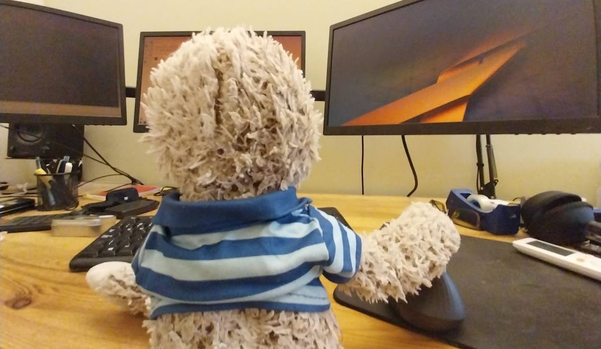

# Cornelius The Sloth (Character Sketch)

The purpose of this repository is to hold a character sketch and a couple of photographs intended to provide the basis for an AI avatar project. 

The character sketch is, of course, entirely ridiculous and fictitious. It roughly maps on to the joke personality I've ascribed, at least in my own head, to a plushie sloth.

I've used RunwayML To create some rather entertaining short videos based on keyframe animation. And it's an ongoing aspiration to take the wacky idea a little bit further. Hence this repository has the basic sketch and a "headshot" for thumbnails and to try out on some generative AI tools.. 

## Author

Daniel Rosehill  
(public at danielrosehill dot com)

## Licensing

This repository is licensed under CC-BY-4.0 (Attribution 4.0 International) 
[License](https://creativecommons.org/licenses/by/4.0/)

### Summary of the License
The Creative Commons Attribution 4.0 International (CC BY 4.0) license allows others to:
- **Share**: Copy and redistribute the material in any medium or format.
- **Adapt**: Remix, transform, and build upon the material for any purpose, even commercially.

The licensor cannot revoke these freedoms as long as you follow the license terms.

#### License Terms
- **Attribution**: You must give appropriate credit, provide a link to the license, and indicate if changes were made. You may do so in any reasonable manner, but not in any way that suggests the licensor endorses you or your use.
- **No additional restrictions**: You may not apply legal terms or technological measures that legally restrict others from doing anything the license permits.

For the full legal code, please visit the [Creative Commons website](https://creativecommons.org/licenses/by/4.0/legalcode).